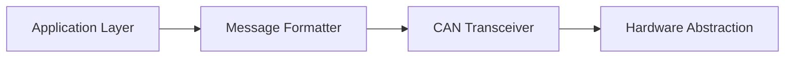

# Open-SOURCE CAN Protocol Stack 🚀

**A free, open-source implementation of the Controller Area Network (CAN) protocol stack for embedded systems.**

---

## 📌 Overview
This project provides a flexible and lightweight **open-source CAN protocol stack** designed for embedded systems. Its core feature is an **interactive web-based configuration wizard** that simplifies the setup and deployment of CAN communication for various microcontrollers and operating systems.

Built with developers in mind, this MIT-licensed project aims to streamline CAN stack integration by offering:
- **Simplified Code Generation**: Automatically generate tailored C code based on user configuration.
- **Cross-Platform Support**: Target different MCUs (STM32, ESP32, AVR, etc.) and OS environments (Bare-metal, FreeRTOS, AUTOSAR).
- **Protocol Flexibility**: Configure standard CAN 2.0A/B, CAN FD, and potentially higher-level protocols like CANopen, J1939, and UDS through the wizard.
- **Easy Integration**: Integrate the generated, self-contained code into your existing embedded projects.
- **Extensive Documentation**: Clear guides and examples to get you started quickly.

---

## 🚀 Features
- **Interactive Web Configuration Wizard**:
    - **Platform Selection**: Choose target MCU and Operating System (Bare-metal, FreeRTOS, AUTOSAR).
    - **Protocol Configuration**: Select CAN standard (CAN 2.0A/B, CAN FD) and configure parameters (baud rate, filters). Supports setup for higher-level protocols (CANopen, J1939, UDS).
    - **DBC File Upload**: Import `.dbc` files to define messages and signals.
    - **Message Editor**: Define and configure CAN messages, including IDs, DLC, and signals.
    - **Code Preview & Download**: Instantly preview and download the generated C code tailored to your configuration.
- **Protocol Compliance**: Adherence to CAN 2.0A/B and CAN FD standards.
- **Message Framing**: Support for standard/extended identifiers and flexible Data Length Codes (DLC).
- **Error Handling**: Includes mechanisms for error detection and reporting (implementation details may vary by target).
- **Modular Generated Code**: The output code is designed for easy integration.
- **Cross-Platform Support**: Generates code compatible with various MCUs like STM32, AVR, ESP32, and potentially others.

---

## 🛠 Installation & Setup
1. **Clone the repository**
   ```bash
   git clone git@github.com:choudharyom/open-source_can_stack.git
   cd open-source-can-stack
   ```

2. **Install dependencies**
   ```bash
   npm install
   ```

3. **Run the web interface (for configuration generation)**
   ```bash
   npm run dev
   ```
   Open [http://localhost:3000](http://localhost:3000) to access the configuration wizard.

4. **Generate code for your device**
   Use the web interface to:
   - Select your MCU/OS
   - Configure protocol parameters
   - Download generated code for your system

---

## 🛠 Usage Example
1. Visit the web interface at [http://localhost:3000](http://localhost:3000)
2. Configure your CAN parameters:
   - Baud rate (e.g., 125 kbps)
   - Message ID formats
   - Payload structures
3. Select your target hardware (e.g., STM32 Nucleo board)
4. Download pre-configured C code
5. Integrate the generated code into your embedded system

---

## 🔧 Technical Details
### Supported Features
| Feature                | Supported? |
|------------------------|------------|
| Standard CAN messages  | ✔️         |
| Extended CAN messages  | ✔️         |
| Bit Timing Configuration | ✔️      |
| Hardware Error Detection | ✔️     |
| Message Filtering      | ✔️         |
| ISO 15765-2 Transport (ISO-TP) | 🚧 In Progress |

### Architecture Overview


---

## 🤝 Contributing
1. Fork the repository
2. Create your feature branch (`git checkout -b feature/your-feature`)
3. Implement your changes
4. Ensure tests pass (`npm test`)
5. Submit a pull request

**Areas needing help:**
- Adding support for new microcontrollers
- Improving documentation
- Optimizing performance for low-power systems

---

## � Development Roadmap

### 1. Core Configuration & Generation
- [X] **Web Interface**: Interactive wizard for configuration.
    - [X] MCU Selection
    - [X] OS Selection (Bare-metal, FreeRTOS, AUTOSAR)
    - [X] Protocol Selection (CAN 2.0 A/B, CAN FD)
    - [X] Parameter Configuration (Baud Rate, Filters)
    - [X] DBC File Upload & Parsing
    - [X] Message/Signal Editor
    - [X] Code Preview
    - [X] Code Download
- [X] **Code Generation Engine**: `codeGenerator.js` utility.
- [X] **Basic CAN Support**: Frame structure, standard/extended IDs.
- [X] **CAN FD Support**: Increased data lengths.

### 2. Higher-Level Protocol Support (Configuration & Generation Logic)
#### CANopen
- [X] Object Dictionary Handling (via DBC/Editor)
- [X] SDO/PDO Configuration Generation
- [X] NMT State Machine Logic Generation
#### J1939
- [X] PGN/SPN Configuration (via DBC/Editor)
- [X] Address Claiming Logic Generation
- [ ] Transport Protocol (Multi-packet) Generation
#### UDS (ISO 14229 / ISO 15765-2)
- [X] Diagnostic Service Handler Generation
- [X] Security Access Mechanism Generation
- [X] Session Management Generation
- [ ] ISO-TP (Transport Layer) Implementation

### 3. Target Platform Integration Code
#### Bare-metal
- [X] Interrupt-based Driver Templates
- [X] Polling-based Driver Templates
- [X] Hardware Abstraction Layer (HAL) Examples/Templates
#### FreeRTOS
- [X] Task-based Message Handling Wrappers
- [X] Queue-based Communication Wrappers
- [ ] Notification Mechanism Examples
#### AUTOSAR
- [X] COM Module Configuration Generation
- [X] PDU Router Configuration Generation
- [ ] AUTOSAR-compliant Interface Wrappers

### 4. Future Enhancements / To-Do
- [ ] **Error Handling**: Add more detailed examples and configuration options for error handling logic.
- [ ] **Simulation Mode**: Allow testing configurations without physical hardware.
- [ ] **Project Persistence**: Implement saving/loading of configurations within the web tool.
- [ ] **Configuration Presets**: Add templates for common setups.
- [ ] **Testing**: Expand automated tests for generated code.
- [ ] **Documentation**: Add more in-depth guides for specific protocols and platforms.
- [ ] **New MCUs/OS**: Expand the list of supported targets.

## �📝 License
This project is licensed under the **MIT License** - see the [LICENSE](LICENSE) file for details.

---

## 🤔 Questions/Feedback?
Open an issue or reach out to our community:
- Discord: [Join here](#)
- Forum: [Discuss here](#)

Made with ❤️ for embedded developers everywhere!
